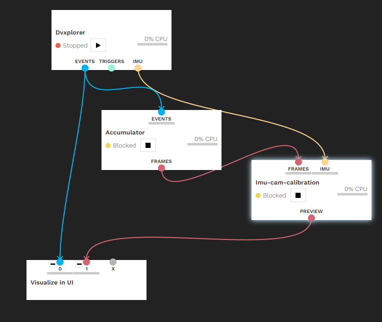
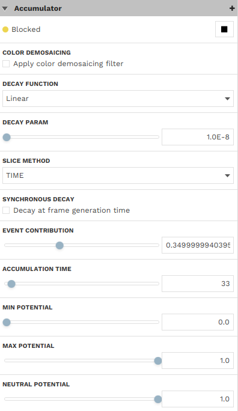
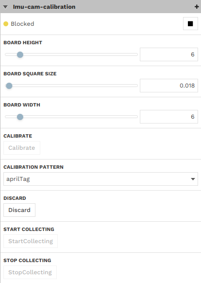
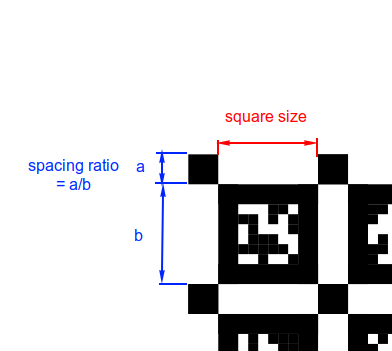
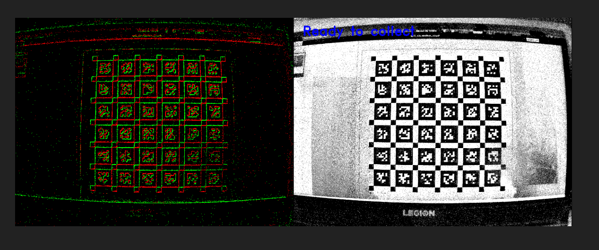
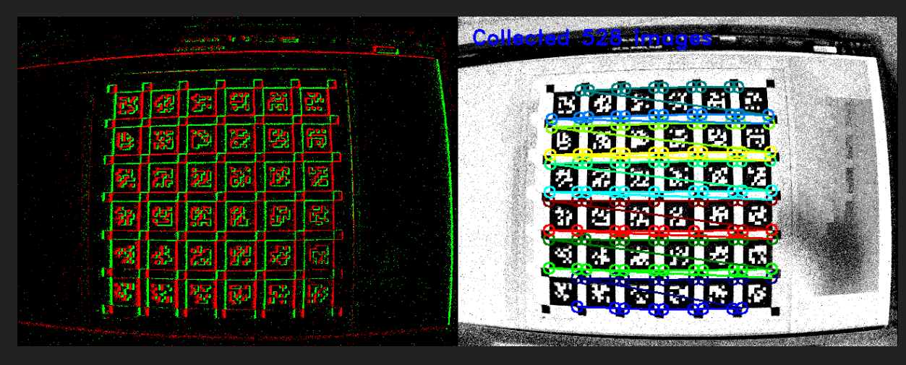

# Camera-IMU calibration [Tutorial]

## Goals

Calculate camera visual-inertial calibration parameters. Calibrate camera intrinsics, spatial and temporal calibration 
of an IMU with respect to the camera. This step is essential to many computer vision applications such as SLAM or 3D 
reconstruction. This code is based on [kalibr](https://github.com/ethz-asl/kalibr).

## Prerequisites

An iniVation camera with built-in IMU, printed calibration pattern with known size.

## Procedure

### DV Set-Up

The configuration of the DV modules consists of the camera module and a camera-IMU calibration module. In case of an 
event camera we also need to use an accumulator to convert events to image frames. A sample structure using an event camera is shown below.

The following parameters have to be set:
- accumulator
  - decay function = linear
  - decay param = 1e-8
  - event contribution = 0.35
  - min potential = 0.0
  - max potential = 1.0

- dv-imu-cam-calibration
  - calibration pattern (recommended aprilgrid)
  - size of the calibration pattern (eg. 6x6)
  - board square size  
  - tag spacing ratio (apriltag only)

### Calibrating

You need to use an asymmetric calibration pattern to calibrate IMU and camera. Three calibration pattern types are 
supported:
- checkerboard 
- asymmetric circles grid
- apriltag

We highly recommend using apriltag as the calibration pattern [file](april_6x6_2x2cm.pdf). 

Put your calibration pattern in a fixed position, for example hang it on the wall. Make sure that it is perfectly 
flat and that the corners of the sheet are touching the wall. 

Click "Start collecting" on the calibration module.

Start moving the camera along each axis of translation and rotation making sure that the calibration pattern is all 
the time visible in the image frame.

We recommend to do the following sequence of motions with a gentle, moderate speed:
 - tilt the camera 3x left and 3x right 
 - tilt the camera 3x up and 3x down
 - rotate the camera 3x left and 3x right
 - move the camera 3x up and 3x down
 - move the camera 3x left and 3x right
 - move the camera 3x forward and 3x backward
 - perform a couple of random rotations and translations

The calibration sequence should be about 60 seconds long. After you have finished the motion click "Stop collecting" 
button on the module. If you are happy with the data you collected you can click "Calibrate" button and wait a couple
of minutes for the calculations to be completed.

### Results

The results of the calibration will be printed in the DV log as well as in the output directory specified in the 
calibration module config (by default your home directory).

### Template project

For details on how modules can be connected and configured please refer to the [template project](docs/template_dv_project.xml), 
which can be loaded using DV-GUI or inspected using a text editor.
